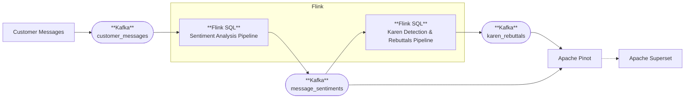
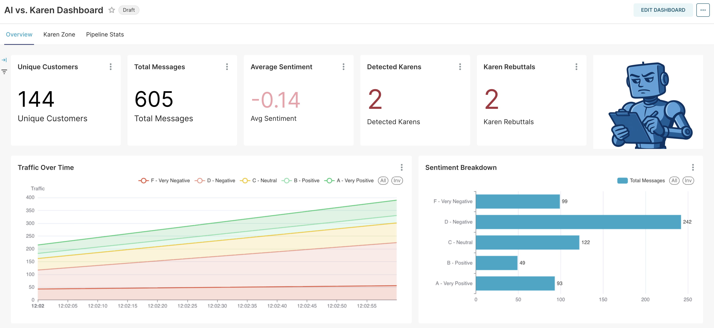

# AI vs. Karen: Real-time Sentiment Detection


Welcome to **AI vs. Karen**, the demo nobody asked for, yet somehow you ended up here looking for its code.  

This repo contains the source code behind the talk's real-time streaming pipeline that listens to customer messages, analyzes their sentiment with AI, identifies "hostile" customers, and uses Gen AI to tell them to shove it... 

It’s part parody, part engineering showcase:  
- **Parody** because it was born out of the “Aimless Innovations Inc.” data — a fake e-commerce company selling very real useless products.  
- **Engineering showcase** because under the hood it uses the same serious big-data stack you’d use in production: Kafka, Flink, Pinot, Superset, OpenAI and a fine-tuned Transformer model.  


## 🎯 What This Demo Shows

This project showcases how modern streaming technologies can be combined with AI to perform real-time inference (especially for identifying unhinged, hostile, Karen-esque customers) as part of a data pipeline that can scale to any size — while having a few laughs along the way.  

The demo code covers 3 approaches:

- LLM-based inference (using OpenAI)
- Open-source encoder-only transformer (SLM)-based inference 
- Custom model, fine-tuned using data generated by an LLM

## 🏗️ Architecture




**Key Technologies:**
- **Redpanda**: Kafka-compatible streaming platform
- **Apache Flink**: Stream processing with SQL and Python UDFs
- **Apache Pinot**: Real-time OLAP database
- **Apache Superset**: Interactive dashboards
- **Kafdrop**: Kafka UI for topic/message visualization
- **OpenAI SDK**: Used for LLM-powered Flink UDFs *(GPT-4.1-Nano for sentiment classification and GPT-4o for witty rebuttals)*
- **Hugging Face Transformers & PyTorch**: Used for local inference Flink UDFs *(details about specific models below)*

## 🚀 Demo Setup

### Prerequisites
- **Docker runtime**: Docker Desktop OR Colima (with at least 8GB RAM allocated)
- **Docker Compose v2** (required - uses `docker compose` command, not legacy `docker-compose`)
- OpenAI API key (stored in ./flink/.env)

### Quick Start

1. **Clone and setup:**
   ```bash
   git clone <this-repo>

   # If using OpenAI features (recommended for full experience)
   echo "OPENAI_API_KEY=sk-your-actual-api-key-here" > flink/.env
   ```

2. **Start core services:**
   ```bash
   # Start Redpanda (Kafka)
   docker compose up -d redpanda

   # Optional: Start Kafdrop (Kafka UI: http://localhost:9001)
   docker compose up -d kafdrop

   # Create Kafka topics (should be created automatically, but just in case)
   docker exec redpanda rpk topic create customer_messages --partitions 4 --replicas 1 || true
   docker exec redpanda rpk topic create message_sentiments --partitions 4 --replicas 1 || true
   docker exec redpanda rpk topic create karen_rebuttals --partitions 4 --replicas 1 || true

   # Start Flink (Web UI: http://localhost:8081, SQL Gateway: http://localhost:8083)
   docker compose up -d flink

   # Start Pinot (Controller UI: http://localhost:9000) and register tables
   docker compose up -d pinot-zookeeper pinot-controller pinot-broker pinot-server
   ./pinot/setup-pinot.sh   # registers schema & tables for real-time ingestion

   # Start Superset (http://localhost:8088)
   docker compose up -d superset
   ```

### Deploy a pipeline:
   
   #### Pick your adventure 
   
   To deploy the **OpenAI** sentiment analysis + Karen rebuttals:
   ```bash
   python3 flink/scripts/submit_flink_sql.py pipeline_sentiment_openai.sql
   python3 flink/scripts/submit_flink_sql.py pipeline_karen_rebuttals.sql
   ```
   
   To deploy the **local Hugging Face model** sentiment analysis (`tabularisai`) + Karen rebuttals:
   ```bash
   python3 flink/scripts/submit_flink_sql.py pipeline_sentiment_local.sql
   python3 flink/scripts/submit_flink_sql.py pipeline_karen_rebuttals.sql
   ```
   
   To deploy the **custom fine-tuned model** sentiment analysis + Karen rebuttals:
   ```bash
   python3 flink/scripts/submit_flink_sql.py pipeline_sentiment_custom_model.sql
   python3 flink/scripts/submit_flink_sql.py pipeline_karen_rebuttals.sql
   ```

### Stream it like it's hot:

Start streaming traffic by running the producer:
   ```bash
   docker compose --profile producer up -d producer
   ```

Open the UIs and enjoy the show:

  > **🔐 Access & Credentials:** 
  >
  > Superset public access is enabled. But if you want to make changes you can optionally login with: `demo` / `demo123`.
  
   - Superset (main sentiment dashboard): http://localhost:8088/superset/dashboard/1
   - Kafdrop (Kafka UI): http://localhost:9001
   - Flink Web UI: http://localhost:8081
   - Pinot UI (query console): http://localhost:9000 
   
   

## 📊 What You'll See




The dashboard displays:
- **Real-time sentiment trends** over time
- **Sentiment distribution** (Very Negative, Negative, Neutral, Positive, Very Positive)
- **Message volume** and processing rates
- **Karen rebuttals** (when a customer sends ≥5 very negative messages in 5 minutes)
- **Model comparison** (OpenAI vs. local vs. custom)


## 🧰 Requirements & Resource Notes

- Recommended: >8 GB RAM available for Docker
- Current limits (compose): Flink 6GB; Redpanda 1.2GB; Pinot services 1GB each; Superset 1GB; Kafdrop 1GB. Depending on your hardware you might need to configure things differently in [docker-compose.yml](/docker-compose.yml) 


> **Performance note (Flink Python UDFs):** 
>
> Flink's Python UDFs can run more efficiently using **thread mode**.  
> This demo defaults to **process mode** because PemJa which is needed for thread mode is not supported on Apple Silicon as of August 2025.  
> If you are running on a different architecture, try thread mode for lower memory overhead and better performance.  
>
>You can switch it in [docker-compose.yml](/docker-compose.yml)  under `FLINK_PROPERTIES`: 
>
>   `python.execution-mode: process` → `python.execution-mode: thread`


If your laptop sounds like a jet, that’s the sound of real-time AI doing its thing.


## 🤗 Custom Sentiment Model
The "custom model" pipeline uses `JosefGoldstein/modernBERT-base-AIvsKaren-sentiment` which is a fine-tune of ModernBERT-base that was created especially for this project.

You can find the model and its training data on Hugging Face: https://huggingface.co/JosefGoldstein/modernBERT-base-AIvsKaren-sentiment


## 📝 Licensing

- All source code in this repo is licensed under **Apache 2.0**.
- The Local model sentiment pipeline uses [tabularisai/multilingual-sentiment-analysis](https://huggingface.co/tabularisai/multilingual-sentiment-analysis) 
  which is licensed separately under [CC BY-NC 4.0](https://creativecommons.org/licenses/by-nc/4.0/).  
  See the `NOTICE` file for detailed third-party attributions and license notes.

👉 Translation: you’re free to use the code however you like (yes, even in production).  
But the mentioned model is **non-commercial only** — fine for demos, research, and talks, not fine for SaaS products or corporate deployments.  


---

*Built with ❤️ for the data streaming and AI community (even you, Karen)* 